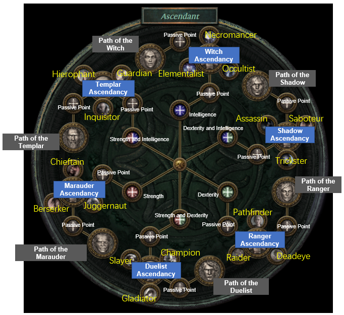

- [Определение](#Определение)
- [Основные характеристики дерева навыков](#Основные%20характеристики%20дерева%20навыков)
- [Преимущества дерева навыков](SkillsTree.md#Преимущества%20дерева%20навыков)
- [Пример](#Пример)
- [Ссылки](#Ссылки)
### Определение

Дерево навыков (или дерево умений) — это система прогрессии, часто используемая в видеоиграх, ролевых играх, которая позволяет игрокам или пользователям последовательно развивать свои навыки и способности. В этой системе навыки структурированы иерархически, подобно ветвям и листьям дерева. Комбинация нескольких веток навыков с разными специальностями и возможностью их комбинации выглядит как паутина.

### Основные характеристики дерева навыков:

1. **Корни (базовые навыки)**: В центральной части дерева по кругу находятся начальные, базовые навыки, которые легко доступны и служат фундаментом для дальнейшего развития.
    
2. **Ветви (промежуточные навыки)**: Ветви представляют собой промежуточные навыки, которые требуют владения базовыми навыками. Эти навыки часто специализируются и развивают определённые аспекты возможностей персонажа или пользователя.
    
3. **Листья (продвинутые навыки)**: На вершине дерева находятся самые продвинутые и мощные навыки. Они требуют полного освоения предыдущих ветвей и базовых навыков.
    
4. **Узлы (узловые точки)**: Точки, в которых ветви расходятся, представляют собой выборы или решения, которые пользователь должен принять для дальнейшего развития. Эти узлы могут вести к различным путям прогрессии.

### Преимущества дерева навыков:

- **Структурированное обучение**: Позволяет пользователям поэтапно осваивать навыки, начиная с простых и двигаясь к более сложным.
- **Мотивация и цели**: Дает пользователям чёткие цели и мотивацию для достижения новых уровней мастерства.
- **Специализация**: Позволяет игрокам или пользователям развивать специфические навыки, подходящие под их стиль игры или учебные цели.

### Пример

### Ссылки
- [Навыки](Skills.md)

[Глоссарий](../Glossary.md) | [Главная](../Shenghua%20Quest.md) 